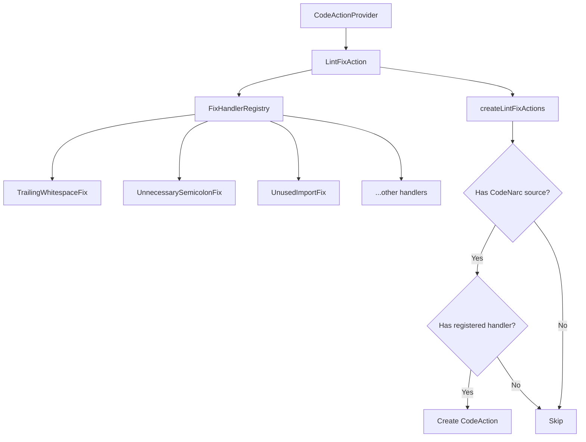

# Design Document: CodeNarc Lint Fixes

## Overview

This design describes the implementation of deterministic CodeNarc lint fix actions for the Groovy LSP. The system extends the existing `LintFixAction` class to provide automatic quick-fix code actions for common CodeNarc violations.

The implementation uses a registry-based architecture where each CodeNarc rule name maps to a fix handler function. This allows for easy extensibility and clear separation of concerns.

## Architecture



### Key Design Decisions

1. **Registry Pattern**: Fix handlers are registered by rule name in a map, allowing O(1) lookup and easy addition of new handlers.

2. **Functional Handlers**: Each handler is a function `(FixContext) -> TextEdit?` that returns null if the fix cannot be applied.

3. **Immutable Context**: Handlers receive a `FixContext` data class containing all necessary information (diagnostic, content, lines).

4. **Fail-Safe**: Invalid diagnostics or out-of-bounds ranges result in null returns, not exceptions.

## Components and Interfaces

### FixContext

```kotlin
/**
 * Context passed to fix handlers containing all information needed to create a fix.
 */
data class FixContext(
    val diagnostic: Diagnostic,
    val content: String,
    val lines: List<String>,
    val uriString: String,
)
```

### FixHandler Type Alias

```kotlin
/**
 * A function that creates a TextEdit for a specific CodeNarc violation.
 * Returns null if the fix cannot be applied.
 */
typealias FixHandler = (FixContext) -> TextEdit?
```

### FixHandlerRegistry

```kotlin
/**
 * Registry of fix handlers keyed by CodeNarc rule name.
 */
object FixHandlerRegistry {
    private val handlers: Map<String, FixHandler> = mapOf(
        // Phase 1: Whitespace/Formatting
        "TrailingWhitespace" to ::fixTrailingWhitespace,
        "UnnecessarySemicolon" to ::fixUnnecessarySemicolon,
        "ConsecutiveBlankLines" to ::fixConsecutiveBlankLines,
        "BlankLineBeforePackage" to ::fixBlankLineBeforePackage,
        
        // Phase 2: Import Cleanup
        "UnusedImport" to ::fixRemoveImportLine,
        "DuplicateImport" to ::fixRemoveImportLine,
        "UnnecessaryGroovyImport" to ::fixRemoveImportLine,
        "ImportFromSamePackage" to ::fixRemoveImportLine,
        
        // Phase 3: Convention Fixes
        "UnnecessaryPublicModifier" to ::fixUnnecessaryPublicModifier,
        "UnnecessaryDefInVariableDeclaration" to ::fixUnnecessaryDef,
        "UnnecessaryGetter" to ::fixUnnecessaryGetter,
        "UnnecessarySetter" to ::fixUnnecessarySetter,
        "UnnecessaryDotClass" to ::fixUnnecessaryDotClass,
    )
    
    fun getHandler(ruleName: String): FixHandler? = handlers[ruleName]
    
    fun getTitle(ruleName: String): String = titles[ruleName] ?: "Fix $ruleName"
    
    private val titles: Map<String, String> = mapOf(
        "TrailingWhitespace" to "Remove trailing whitespace",
        "UnnecessarySemicolon" to "Remove unnecessary semicolon",
        "ConsecutiveBlankLines" to "Remove consecutive blank lines",
        "BlankLineBeforePackage" to "Remove blank lines before package",
        "UnusedImport" to "Remove unused import",
        "DuplicateImport" to "Remove duplicate import",
        "UnnecessaryGroovyImport" to "Remove unnecessary import",
        "ImportFromSamePackage" to "Remove same-package import",
        "UnnecessaryPublicModifier" to "Remove unnecessary 'public'",
        "UnnecessaryDefInVariableDeclaration" to "Remove unnecessary 'def'",
        "UnnecessaryGetter" to "Use property access",
        "UnnecessarySetter" to "Use property assignment",
        "UnnecessaryDotClass" to "Remove '.class'",
    )
}
```

### Updated LintFixAction

The existing `LintFixAction` class will be enhanced to use the registry:

```kotlin
class LintFixAction {
    fun createLintFixActions(
        uriString: String,
        diagnostics: List<Diagnostic>,
        content: String,
    ): List<CodeAction> {
        val lines = content.lines()
        
        return diagnostics.mapNotNull { diagnostic ->
            createFixForDiagnostic(uriString, diagnostic, content, lines)
        }
    }
    
    private fun createFixForDiagnostic(
        uriString: String,
        diagnostic: Diagnostic,
        content: String,
        lines: List<String>,
    ): CodeAction? {
        // Only handle CodeNarc diagnostics
        if (!diagnostic.source.equals("CodeNarc", ignoreCase = true)) {
            return null
        }
        
        // Get rule name from diagnostic code
        val ruleName = extractRuleName(diagnostic) ?: return null
        
        // Look up handler
        val handler = FixHandlerRegistry.getHandler(ruleName) ?: return null
        
        // Create context and invoke handler
        val context = FixContext(diagnostic, content, lines, uriString)
        val textEdit = handler(context) ?: return null
        
        // Build CodeAction
        return createCodeAction(
            uriString = uriString,
            title = FixHandlerRegistry.getTitle(ruleName),
            textEdit = textEdit,
            diagnostic = diagnostic,
        )
    }
    
    private fun extractRuleName(diagnostic: Diagnostic): String? {
        val code = diagnostic.code ?: return null
        return when {
            code.isLeft -> code.left
            code.isRight -> code.right?.toString()
            else -> null
        }
    }
}
```

## Data Models

### Diagnostic Structure (from LSP4J)

The system relies on the standard LSP Diagnostic structure:

```kotlin
// From org.eclipse.lsp4j.Diagnostic
class Diagnostic {
    var range: Range          // Start and end positions
    var severity: DiagnosticSeverity
    var code: Either<String, Int>?  // Rule name stored here
    var source: String?       // "CodeNarc" for our diagnostics
    var message: String
}
```

### TextEdit Structure (from LSP4J)

```kotlin
// From org.eclipse.lsp4j.TextEdit
class TextEdit {
    var range: Range    // Range to replace
    var newText: String // Replacement text (empty for deletion)
}
```

## Correctness Properties

*A property is a characteristic or behavior that should hold true across all valid executions of a system-essentially, a formal statement about what the system should do. Properties serve as the bridge between human-readable specifications and machine-verifiable correctness guarantees.*

### Property 1: Registry Lookup Consistency

*For any* registered rule name, looking up the handler should return a non-null handler, and for any unregistered rule name, the lookup should return null.

**Validates: Requirements 1.1, 1.2**

### Property 2: Source Filtering

*For any* diagnostic with a source other than "CodeNarc" (case-insensitive), the system should return null and not attempt to create a fix.

**Validates: Requirements 1.3**

### Property 3: Trailing Whitespace Removal

*For any* line containing trailing whitespace characters, applying the TrailingWhitespace fix should result in a line where `line == line.trimEnd()`.

**Validates: Requirements 2.1**

### Property 4: Semicolon Removal

*For any* statement ending with an unnecessary semicolon, applying the UnnecessarySemicolon fix should result in a statement that does not end with a semicolon (before any trailing whitespace).

**Validates: Requirements 2.2**

### Property 5: Consecutive Blank Lines Reduction

*For any* sequence of N consecutive blank lines where N >= 2, applying the ConsecutiveBlankLines fix should result in exactly 1 blank line.

**Validates: Requirements 2.3**

### Property 6: Import Line Removal

*For any* import statement on a single line, applying an import removal fix (UnusedImport, DuplicateImport, UnnecessaryGroovyImport, ImportFromSamePackage) should result in the complete removal of that line including its newline character.

**Validates: Requirements 3.1, 3.2, 3.3, 3.4**

### Property 7: Public Modifier Removal

*For any* declaration containing the `public` modifier, applying the UnnecessaryPublicModifier fix should result in a declaration without the `public ` substring.

**Validates: Requirements 4.1**

### Property 8: Def Keyword Removal

*For any* variable declaration containing both a type and `def`, applying the UnnecessaryDefInVariableDeclaration fix should result in a declaration without `def `.

**Validates: Requirements 4.2**

### Property 9: Getter to Property Access

*For any* method call of the form `obj.getXxx()` where Xxx starts with uppercase, applying the UnnecessaryGetter fix should result in `obj.xxx` (property access with lowercase first letter).

**Validates: Requirements 4.3**

### Property 10: Setter to Property Assignment

*For any* method call of the form `obj.setXxx(value)` where Xxx starts with uppercase, applying the UnnecessarySetter fix should result in `obj.xxx = value`.

**Validates: Requirements 4.4**

### Property 11: Range Bounds Validation

*For any* diagnostic with a line number exceeding the source line count, the system should return null without throwing an exception.

**Validates: Requirements 5.2, 5.3**

### Property 12: Code Action Structure Validity

*For any* successfully created CodeAction, it should have: (a) kind equal to `CodeActionKind.QuickFix`, (b) a non-empty title, (c) the original diagnostic in its diagnostics list, and (d) a non-null edit with changes.

**Validates: Requirements 6.1, 6.2, 6.3**

### Property 13: Multiple Diagnostics Handling

*For any* list of N diagnostics where M have registered handlers, the system should return exactly M CodeActions.

**Validates: Requirements 6.4**

## Error Handling

1. **Invalid Diagnostic Source**: Return null, log at DEBUG level
2. **Missing Rule Name**: Return null, log at DEBUG level
3. **No Registered Handler**: Return null, log at DEBUG level
4. **Out-of-Bounds Range**: Return null, log at WARN level
5. **Handler Exception**: Catch, log at ERROR level, return null

## Testing Strategy

### Test-Driven Development (TDD) Approach

This implementation follows strict TDD methodology:

1. **Red**: Write a failing test first that defines the expected behavior
2. **Green**: Write the minimal code to make the test pass
3. **Refactor**: Clean up the code while keeping tests green

Each task in the implementation plan will follow this cycle, with tests written before implementation code.

### Property-Based Testing

The implementation will use **jqwik** (already in the project) for property-based testing. Each correctness property will be implemented as a property test with a minimum of 100 iterations.

Property tests will use generators for:
- Random Groovy source code with specific violations
- Random diagnostic ranges (valid and invalid)
- Random rule names (registered and unregistered)

### Unit Testing

Unit tests will cover:
- Each fix handler with representative examples
- Edge cases (empty files, single-line files, files with only whitespace)
- Integration with CodeActionProvider

### Test File Organization

```
groovy-lsp/src/test/kotlin/com/github/albertocavalcante/groovylsp/providers/codeaction/
├── LintFixActionTest.kt           # Unit tests for LintFixAction
├── LintFixActionPropertyTest.kt   # Property-based tests
├── FixHandlerRegistryTest.kt      # Registry tests
└── handlers/
    ├── WhitespaceFixHandlersTest.kt
    ├── ImportFixHandlersTest.kt
    └── ConventionFixHandlersTest.kt
```

### Test Annotations

Each property-based test must be annotated with the property it validates:

```kotlin
@Property(tries = 100)
// **Feature: codenarc-lint-fixes, Property 3: Trailing Whitespace Removal**
// **Validates: Requirements 2.1**
fun trailingWhitespaceRemoval(@ForAll line: String) {
    // ...
}
```

### TDD Workflow Per Feature

For each fix handler:

1. Write property test defining the transformation invariant
2. Write unit test with concrete example
3. Run tests (expect failure)
4. Implement minimal handler code
5. Run tests (expect pass)
6. Refactor if needed
7. Commit
