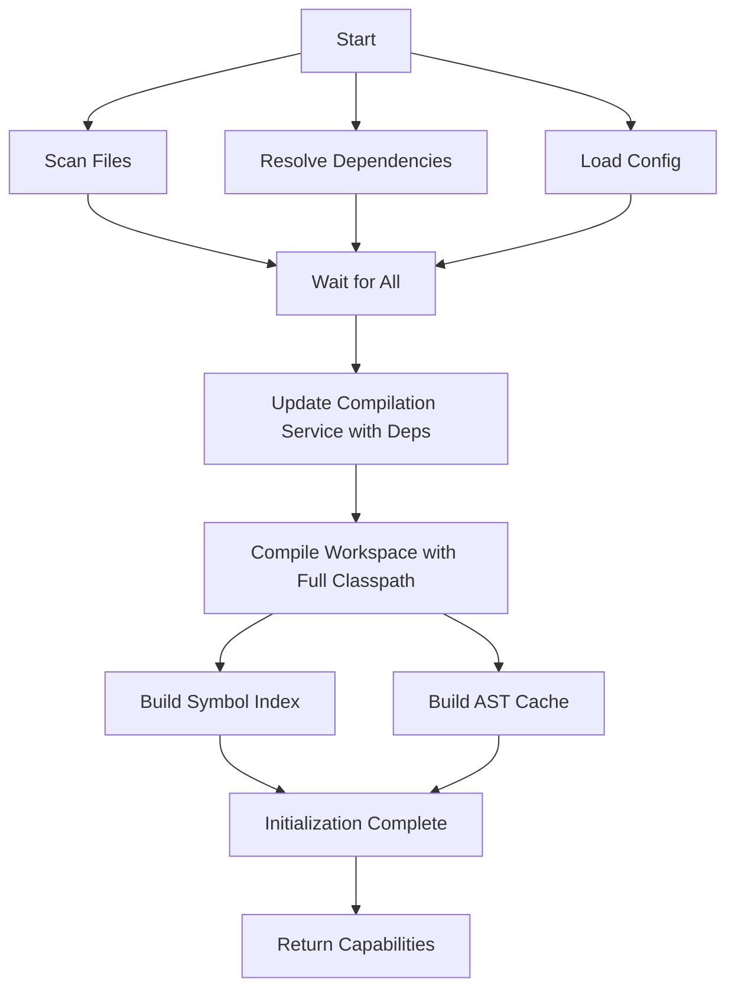

# LSP Initialization Patterns: A Deep Dive

## Table of Contents

1. [The LSP Initialization Contract](#the-lsp-initialization-contract)
2. [Common Initialization Patterns](#common-initialization-patterns)
3. [Anti-Patterns to Avoid](#anti-patterns-to-avoid)
4. [Our Current Problem](#our-current-problem)
5. [Proposed Solutions](#proposed-solutions)
6. [Implementation Details](#implementation-details)
7. [Trade-offs Analysis](#trade-offs-analysis)
8. [Recommendations](#recommendations)

## The LSP Initialization Contract

According to the Language Server Protocol specification:

### Protocol Flow

```
Client                          Server
  |                                |
  |------- initialize request ----->|  // Server MUST block other requests
  |                                |  // Server does initialization
  |<------ initialize response -----|  // Returns capabilities
  |                                |
  |------ initialized notification ->|  // Client confirms receipt
  |                                |
  |------- textDocument/hover ----->|  // Normal operations begin
  |<------ hover response -----------|  // Should work immediately!
```

### Key Requirements

1. **initialize**: Server MUST NOT process other requests until responding
2. **Capabilities**: Server declares what features it supports
3. **Post-initialization**: All declared capabilities should work immediately
4. **Honesty**: Server shouldn't claim capabilities it can't deliver

## Common Initialization Patterns

### Pattern 1: Lazy Loading (TypeScript Server, Pylsp)

**Philosophy**: Start fast, index on-demand

```typescript
// TypeScript Language Server approach
class TSServer {
  initialize() {
    // Minimal setup, no indexing
    return {
      capabilities: {
        hoverProvider: true,
        definitionProvider: true,
      },
    }; // Returns in ~100ms
  }

  onHover(params) {
    if (!this.cache[params.file]) {
      // First request to this file
      this.quickParseFile(params.file); // ~50ms
    }
    return this.cache[params.file].hover(params.position);
  }
}
```

**Pros:**

- ✅ Instant startup (<200ms)
- ✅ Memory efficient (only loads what's needed)
- ✅ Works well for large codebases

**Cons:**

- ❌ First operations are slow
- ❌ No cross-file intelligence initially
- ❌ Complex caching logic required
- ❌ Inconsistent performance

**Real-world example**: VSCode's TypeScript server can start instantly but takes 1-2 seconds for the first
hover/completion in a new file.

### Pattern 2: Upfront Indexing (IntelliJ IDEA, rust-analyzer)

**Philosophy**: Index everything first, then everything works perfectly

```kotlin
// IntelliJ-style approach
class IntelliJLanguageServer {
    fun initialize(params: InitializeParams): CompletableFuture<InitializeResult> {
        return CompletableFuture.supplyAsync {
            // Block while indexing
            reportProgress("Scanning files...", 10)
            val files = scanWorkspace()  // 2-5 seconds

            reportProgress("Resolving dependencies...", 30)
            val deps = resolveDependencies()  // 3-10 seconds

            reportProgress("Building indexes...", 60)
            val index = buildCompleteIndex(files, deps)  // 5-20 seconds

            reportProgress("Ready", 100)
            InitializeResult(capabilities)  // Returns after 10-35 seconds
        }
    }

    fun onHover(params: HoverParams): Hover {
        // Instant lookup in pre-built index
        return index.lookup(params.position)  // <5ms
    }
}
```

**Pros:**

- ✅ Everything works perfectly once ready
- ✅ Consistent, fast performance
- ✅ Full cross-file intelligence
- ✅ Can show accurate progress

**Cons:**

- ❌ Long startup time (10-60 seconds for large projects)
- ❌ High memory usage
- ❌ Blocks editor during initialization
- ❌ User must wait before working

**Real-world example**: IntelliJ IDEA shows "Indexing..." for 15-30 seconds on project open, but then everything works
flawlessly.

### Pattern 3: Progressive Enhancement (Sorbet, gopls)

**Philosophy**: Provide basic features immediately, enhance over time

```go
// Go Language Server (gopls) approach
type GoplsServer struct {
    basicIndex   *QuickIndex    // Built quickly
    fullIndex    *CompleteIndex // Built in background
    indexState   IndexState
}

func (s *GoplsServer) Initialize(params) InitializeResult {
    // Quick initialization (1-2 seconds)
    s.basicIndex = buildQuickIndex(params.RootPath)

    // Start background enhancement
    go func() {
        s.fullIndex = buildFullIndex(params.RootPath)
        s.indexState = FullyIndexed
    }()

    return InitializeResult{
        Capabilities: Capabilities{
            HoverProvider: true,        // Works immediately (basic)
            DefinitionProvider: true,   // Works immediately (basic)
            ReferencesProvider: true,   // Enhanced when ready
        },
    }
}

func (s *GoplsServer) Hover(params) Hover {
    if s.indexState == FullyIndexed {
        return s.fullIndex.GetHover(params)  // Full intelligence
    }
    return s.basicIndex.GetHover(params)     // Basic, single-file
}
```

**Pros:**

- ✅ Fast initial response (1-3 seconds)
- ✅ Features work immediately (degraded)
- ✅ Progressive improvement
- ✅ Non-blocking

**Cons:**

- ❌ Complex dual-path implementation
- ❌ Inconsistent feature quality initially
- ❌ Hard to communicate state to user
- ❌ May need to invalidate early results

**Real-world example**: gopls provides immediate go-to-definition within a file, but cross-package navigation improves
after ~10 seconds.

### Pattern 4: Hybrid Async Coordination (Modern approach)

**Philosophy**: Use async coordination to optimize both startup time and correctness

```kotlin
// Modern coordinated approach (proposed for groovy-lsp)
class ModernLanguageServer {
    fun initialize(params: InitializeParams): CompletableFuture<InitializeResult> {
        val future = CompletableFuture<InitializeResult>()

        coroutineScope.launch {
            // Phase 1: Parallel gathering (fast I/O operations)
            val (files, deps, config) = awaitAll(
                async(IO) { scanFiles(root) },        // 2s
                async(IO) { resolveDependencies() },  // 5s
                async(IO) { loadConfig() }            // 0.5s
            )  // Total: 5s (parallel instead of 7.5s sequential)

            // Phase 2: CPU-intensive work with all data
            val index = async(Default) {
                buildIndexWithDeps(files, deps)  // 3s
            }.await()

            // Phase 3: Ready
            future.complete(InitializeResult(capabilities))
            // Total: ~8s with parallelism vs 10.5s sequential
        }

        return future
    }
}
```

**Pros:**

- ✅ Optimized startup time through parallelism
- ✅ Everything works correctly when ready
- ✅ Honest about capabilities
- ✅ Clean architecture

**Cons:**

- ❌ Still blocks initialization (but optimized)
- ❌ Requires careful coordination
- ❌ Async complexity

## Anti-Patterns to Avoid

### Anti-Pattern 1: Fire and Forget (Our Current Problem!)

```kotlin
// DON'T DO THIS - This is what groovy-lsp currently does
class BrokenLanguageServer {
    fun initialize(params: InitializeParams): InitializeResult {
        // Returns immediately, claiming we're ready
        return InitializeResult(capabilities)  // LIES!
    }

    fun initialized() {
        // Start async work AFTER claiming ready
        coroutineScope.launch {
            workspaceCompilation.initialize()  // Async, no waiting
        }
        launch {
            resolveDependencies()  // Async, no waiting
        }
        client.showMessage("Ready!")  // FALSE! Nothing is ready!
    }

    fun hover(params: HoverParams): Hover? {
        // This returns null because nothing is initialized yet
        return astVisitor?.getHover()  // astVisitor is null!
    }
}
```

**Why this is broken:**

- 🔴 Violates LSP contract (claims ready when not)
- 🔴 Features don't work initially
- 🔴 Race conditions everywhere
- 🔴 No way to know when actually ready
- 🔴 Dependencies loaded after compilation (wrong order!)

### Anti-Pattern 2: Blocking Without Progress

```kotlin
// DON'T DO THIS - Freezes the editor
class BadLanguageServer {
    fun initialize(params: InitializeParams): InitializeResult {
        Thread.sleep(30000)  // Block for 30 seconds
        return InitializeResult(capabilities)
    }
    // No progress reporting, editor appears frozen
}
```

### Anti-Pattern 3: Overpromising Capabilities

```kotlin
// DON'T DO THIS - Claiming unsupported features
fun initialize(): InitializeResult {
    return InitializeResult(
        capabilities = ServerCapabilities(
            hoverProvider = true,          // But hover() returns null
            definitionProvider = true,     // But definition() crashes
            referencesProvider = true,     // But references() not implemented
        )
    )
}
```

## Our Current Problem

### The Broken Flow in groovy-lsp

```kotlin
// Current implementation (BROKEN)
class GroovyLanguageServer {
    // Step 1: Initialize returns immediately
    initialize() {
        return InitializeResult(capabilities)  // Claims ready in ~10ms
    }

    // Step 2: Start async work AFTER claiming ready
    initialized() {
        coroutineScope.launch {
            // This happens LATER, async
            workspaceCompilation?.initializeWorkspace()  // 5-10s async
        }
        startAsyncDependencyResolution {              // 3-8s async
            onComplete = { deps ->
                // Dependencies arrive AFTER compilation!
                compilationService.updateDependencies(deps)
            }
        }
    }

    // Step 3: User tries to use features
    hover(params) {
        val ast = compilationService.getAstVisitor()  // Returns null!
        return null  // "No hover information available"
    }
}
```

### The Timing Disaster

```
Time    Client                  Server
0ms     initialize --------->   Returns immediately (WRONG!)
10ms    <------- "ready"        (But nothing is ready)
15ms    initialized -------->   Starts async work
20ms    hover request ------>   getAstVisitor() = null ❌
...
5000ms                          Workspace compilation finishes
8000ms                          Dependencies arrive
8001ms                          Updates compilation (too late!)
```

### Why Everything Fails

1. **Hover fails**: No AST because workspace isn't compiled yet
2. **Go-to definition fails**: No symbol table built yet
3. **Type resolution fails**: Compilation happened without dependencies
4. **References fail**: No cross-file index exists

The dependencies issue is particularly bad:

- Workspace compiles at 5000ms WITHOUT classpath
- Dependencies arrive at 8000ms
- AST was already built without external types
- Can't retroactively fix the AST

## Proposed Solutions

### Solution 1: Simple Blocking Fix (Quickest to Implement)

```kotlin
override fun initialize(params: InitializeParams): CompletableFuture<InitializeResult> {
    return CompletableFuture.supplyAsync {
        runBlocking {
            // Just block and do things in the right order
            reportProgress("Resolving dependencies...", 25)
            val deps = resolver.resolveDependencies(workspaceRoot)
            compilationService.updateDependencies(deps)

            reportProgress("Compiling workspace...", 50)
            val workspaceService = WorkspaceCompilationService(coroutineScope)
            compilationService.enableWorkspaceMode(workspaceService)
            val result = workspaceService.initializeWorkspace(workspaceRoot)

            reportProgress("Building indexes...", 75)
            // Verify everything works
            if (result.astVisitor == null) {
                logger.error("Failed to initialize")
            }

            reportProgress("Ready", 100)
            InitializeResult(ServerCapabilities())
        }
    }
}
```

**Implementation effort**: 2-3 hours **Risk**: Low **Improvement**: Everything works correctly

### Solution 2: Coordinated Async (Optimal Performance)

```kotlin
class InitializationCoordinator(
    private val client: LanguageClient,
    private val scope: CoroutineScope
) {
    suspend fun coordinateInitialization(root: Path): InitializationResult {
        return coroutineScope {
            // Phase 1: Parallel I/O operations
            reportPhase("Gathering project information...")

            val filesDeferred = async(Dispatchers.IO) {
                reportProgress("Scanning files...", 10)
                scanGroovyFiles(root)
            }

            val depsDeferred = async(Dispatchers.IO) {
                reportProgress("Resolving dependencies...", 10)
                resolveDependencies(root)
            }

            val configDeferred = async(Dispatchers.IO) {
                reportProgress("Loading configuration...", 10)
                loadConfiguration(root)
            }

            // Await all parallel operations
            val files = filesDeferred.await()
            val deps = depsDeferred.await()
            val config = configDeferred.await()

            reportPhase("Compiling workspace...")

            // Phase 2: Sequential compilation with full context
            val compilationService = GroovyCompilationService().apply {
                updateDependencies(deps)  // BEFORE compilation!
            }

            val workspaceService = WorkspaceCompilationService(scope)
            val compilationResult = workspaceService.initializeWorkspace(root)

            // Phase 3: Parallel index building
            reportPhase("Building indexes...")

            val symbolIndexDeferred = async {
                buildSymbolIndex(compilationResult)
            }

            val astCacheDeferred = async {
                buildAstCache(compilationResult)
            }

            awaitAll(symbolIndexDeferred, astCacheDeferred)

            InitializationResult(
                compilationService = compilationService,
                workspaceService = workspaceService,
                symbolIndex = symbolIndexDeferred.await(),
                astCache = astCacheDeferred.await()
            )
        }
    }
}
```

**Implementation effort**: 8-12 hours **Risk**: Medium (async complexity) **Improvement**: Optimal performance +
correctness

### Solution 3: Progressive Enhancement (Best UX)

```kotlin
class ProgressiveInitializer {
    private enum class Stage {
        BASIC,      // Single-file compilation
        ENHANCED,   // Workspace without deps
        FULL        // Everything ready
    }

    private val currentStage = AtomicReference(Stage.BASIC)

    fun initialize(params: InitializeParams): CompletableFuture<InitializeResult> {
        // Quick basic setup (1-2 seconds)
        setupBasicCompilation()
        currentStage.set(Stage.BASIC)

        // Start enhancement in background
        coroutineScope.launch {
            // Stage 2: Workspace compilation
            val workspaceResult = compileWorkspace()
            currentStage.set(Stage.ENHANCED)
            notifyClient("Enhanced features available")

            // Stage 3: Add dependencies
            val deps = resolveDependencies()
            recompileWithDependencies(deps)
            currentStage.set(Stage.FULL)
            notifyClient("Full features available")
        }

        // Return immediately with degraded capabilities
        return CompletableFuture.completedFuture(
            InitializeResult(getCapabilitiesForStage(Stage.BASIC))
        )
    }

    fun hover(params: HoverParams): Hover? {
        return when (currentStage.get()) {
            Stage.FULL -> fullHover(params)
            Stage.ENHANCED -> enhancedHover(params)
            Stage.BASIC -> basicHover(params)
        }
    }
}
```

**Implementation effort**: 15-20 hours **Risk**: High (complexity, dual code paths) **Improvement**: Best UX but complex

## Implementation Details

### Correct Initialization Order



### Critical Dependency Order

```kotlin
// WRONG ORDER (current bug):
compileWorkspace()                    // Compiles without deps
resolveDependencies().then { deps ->
    updateCompilation(deps)           // Too late! AST already built
}

// CORRECT ORDER:
val deps = resolveDependencies()     // Get deps first
updateCompilation(deps)               // Configure classpath
compileWorkspace()                    // Compile with full context
```

### Progress Reporting Best Practices

```kotlin
private suspend fun reportInitProgress(
    phase: String,
    percentage: Int,
    details: String? = null
) {
    val token = "groovy-initialization"

    client.notifyProgress(
        ProgressParams(
            Either.forLeft(token),
            Either.forLeft(WorkDoneProgressNotification(
                kind = "report",
                percentage = percentage,
                message = phase,
                cancellable = false
            ))
        )
    )

    logger.info("Init progress: $phase ($percentage%)")
}
```

## Trade-offs Analysis

### Performance vs Correctness

| Approach                | Startup Time  | Correctness | Complexity | User Experience |
| ----------------------- | ------------- | ----------- | ---------- | --------------- |
| Fire & Forget (current) | ~10ms ✅      | Broken ❌   | Low        | Frustrating ❌  |
| Simple Blocking         | 10-15s ⚠️     | Perfect ✅  | Low ✅     | Acceptable ✅   |
| Coordinated Async       | 8-10s ✅      | Perfect ✅  | Medium ⚠️  | Good ✅         |
| Progressive             | 2s initial ✅ | Gradual ⚠️  | High ❌    | Best ✅         |

### Memory Usage

- **Lazy Loading**: Low initial, grows over time (1-2GB)
- **Upfront Indexing**: High initial (2-4GB), stable
- **Progressive**: Medium, grows to high (1.5-3GB)

### Implementation Effort

1. **Simple Fix**: 2-3 hours (just reorder operations)
2. **Coordinated Async**: 8-12 hours (proper architecture)
3. **Progressive**: 15-20 hours (dual implementations)

## Recommendations

### Immediate Fix (Do This First)

1. **Make initialization honest** - Block until ready
2. **Load dependencies BEFORE compilation**
3. **Add basic progress reporting**
4. **Test that features work immediately**

```kotlin
// Minimal fix - makes everything work correctly
override fun initialize(params: InitializeParams): CompletableFuture<InitializeResult> {
    return CompletableFuture.supplyAsync {
        runBlocking {
            val deps = resolveDependencies()        // First
            updateCompilationService(deps)          // Second
            initializeWorkspace()                    // Third
            verifyFeaturesWork()                    // Fourth
            InitializeResult(capabilities)          // Finally
        }
    }
}
```

### Long-term Architecture (After Stabilization)

Implement the coordinated async pattern:

- Parallel I/O operations where possible
- Sequential compilation with full context
- Proper progress reporting
- Clean separation of concerns

### Testing Strategy

```kotlin
@Test
fun `hover should work immediately after initialization`() {
    val future = server.initialize(params)
    val result = future.get()  // Wait for actual completion

    val hover = server.hover(hoverParams).get()
    assertNotNull(hover, "Hover should work immediately")
}

@Test
fun `dependencies should be available during compilation`() {
    // Mock to verify deps are loaded BEFORE compilation
    val mockCompiler = mock<WorkspaceCompilationService>()
    whenever(mockCompiler.initializeWorkspace(any())).thenAnswer {
        // At this point, deps should already be in classpath
        assertTrue(compilationService.getDependencyClasspath().isNotEmpty())
    }
}
```

## Conclusion

The current groovy-lsp implementation violates the fundamental LSP contract by claiming readiness before initialization
completes. This causes all language features to fail initially.

The fix is conceptually simple: **Be honest about when we're ready**. Load dependencies first, compile with the full
classpath, then return from initialization.

Whether we implement this as a simple blocking fix or a sophisticated async coordinator is an engineering trade-off, but
the core requirement remains: **Don't lie to the client about readiness**.

### Action Items

1. ✅ Write failing test showing current broken behavior
2. ✅ Implement simple blocking fix with correct ordering
3. ✅ Add progress reporting during initialization
4. ✅ Verify hover/go-to-definition work immediately
5. ⏳ Consider async optimization as future enhancement
6. ⏳ Document initialization architecture decisions

---

_Last Updated: 2024_ _Author: Analysis based on groovy-lsp codebase investigation_
